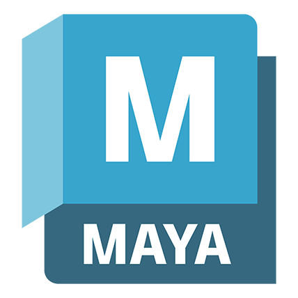
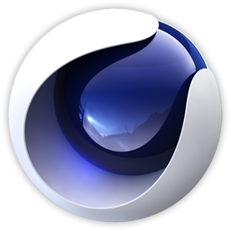
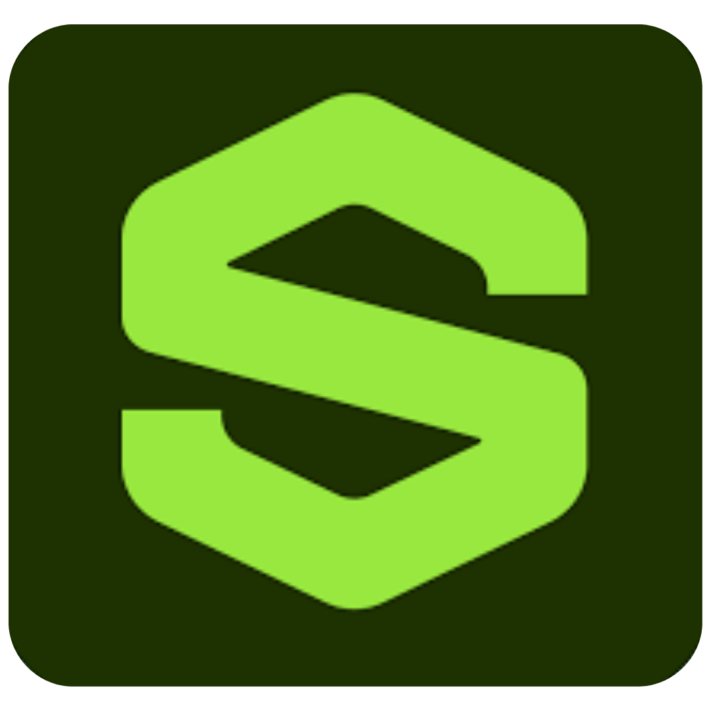
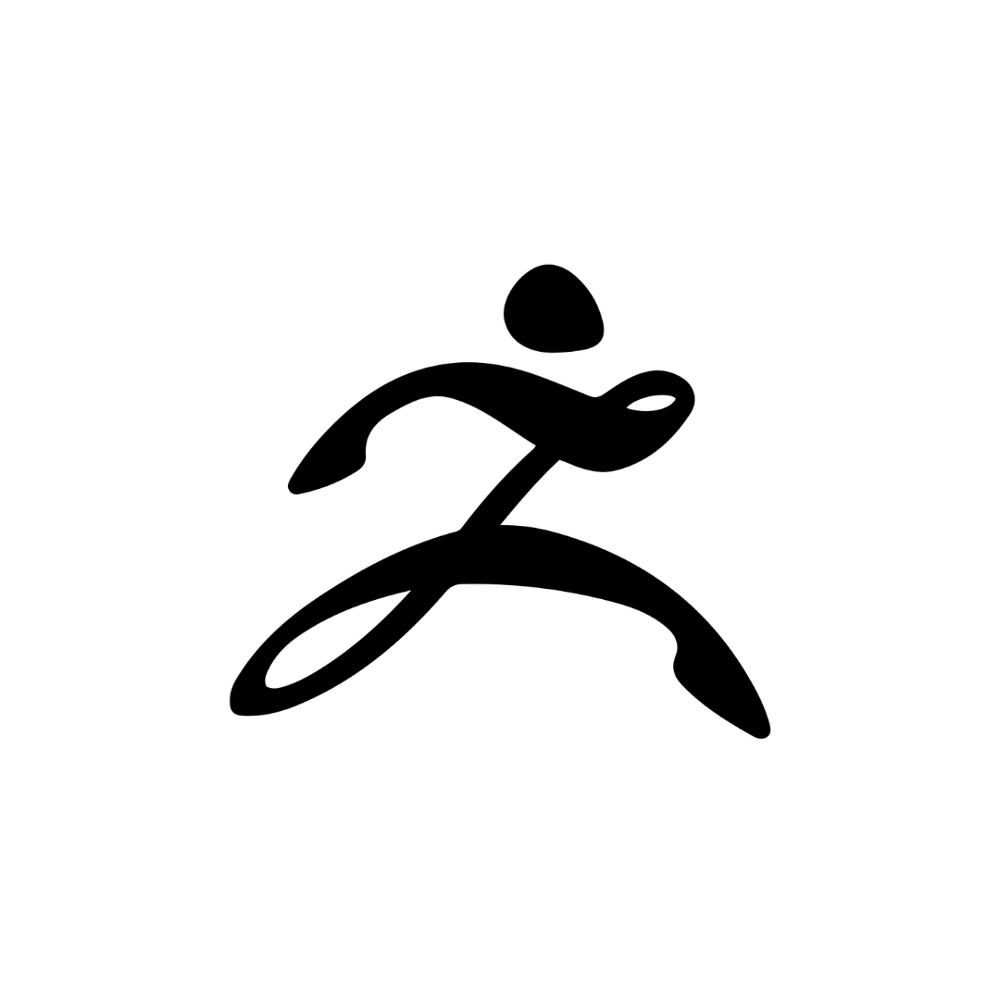

# 👋 Hi, I'm Yahya Ismayilov

  

---

### 🌌 About Me
Hello! My name is **Yahya Ismayilov**.
I have been working as a **3D Artist** and **Game Developer** for almost **5 years**.
I specialize in creating stylized assets, immersive environments, and interactive experiences.
My passion is combining art and technology to bring creative ideas to life.

---

### 🛠️ Tools & Software

| İkon                                                                                             | Uygulama          | Seviye                                     | Tecrübe      |
| :----------------------------------------------------------------------------------------------- | :---------------- | :----------------------------------------- | :----------- |
|                                        | **3ds Max** | <progress max="100" value="95"></progress> | `5000+ Saat` |
|  | **Maya** | <progress max="100" value="85"></progress> | `4000+ Saat` |
|                      | **Blender** | <progress max="100" value="90"></progress> | `4500+ Saat` |
|                                    | **Cinema 4D** | <progress max="100" value="70"></progress> | `1500+ Saat` |
|                          | **Substance P.** | <progress max="100" value="90"></progress> | `3000+ Saat` |
|                                         | **ZBrush** | <progress max="100" value="80"></progress> | `2500+ Saat` |
|  | **Unreal Engine** | <progress max="100" value="85"></progress> | `4000+ Saat` |
---

### 💻 Programming & Scripting

  
  
  

---

### 📊 GitHub & LeetCode Stats

  
  

---

### 🌍 Find Me Online
- 🔗 [LinkedIn](https://www.linkedin.com/in/yehya-ismayilov/)
- 🎮 [Steam Page](https://store.steampowered.com/curator/45575538)
- 🎨 [ArtStation](https://www.artstation.com/darknight_studyo/store?tab=digital_product)
- 🕹️ [Epic Games Fab](https://www.fab.com/tr/sellers/DarkNight%20studio)
- 🖼️ [Sketchfab](https://sketchfab.com/ismayilovyehya.yi)
- 🎮 [itch.io](https://darknightstudio.itch.io/)

---

⭐ Always exploring new creative challenges in **game development** and **3D art**.
