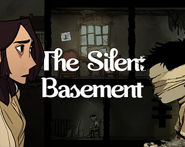
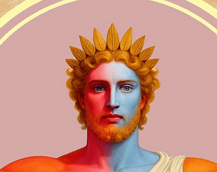

# 👋 Hi, I'm Yahya Ismayilov

  

---

### 🌌 About Me
Hello! My name is **Yahya Ismayilov**.
I have been working as a **3D Artist** and **Game Developer** for almost **5 years**.
I specialize in creating stylized assets, immersive environments, and interactive experiences.
My passion is combining art and technology to bring creative ideas to life.
---

### 💼 My Work Experience (via LinkedIn)

---

### 🛠️ Tools & Software

| Icon                                                                                                     | Application       | Level      | Experience        |
| :------------------------------------------------------------------------------------------------------- | :---------------- | :--------- | :---------------- |
|                      | **3ds Max** | `Beginner` | `6,000+ Hours`    |
|          | **Maya** | `Beginner` | `6,000+ Hours`    |
|                              | **Blender** | `Middle`   | `35,000+ Hours`   |
|                                            | **Cinema 4D** | `Beginner` | `6,000+ Hours`    |
|                                                 | **ZBrush** | `Beginner` | `9,000+ Hours`    |
|                                  | **Substance P.** | `Middle`   | `12,000+ Hours`   |
|      | **Unreal Engine** | `Middle`   | `28,000+ Hours`   |

---

### 💻 Programming & Scripting

  
  
  

---
🎮 My Games
Here are some of the games I've developed. Click on them to check them out!

<table>
<tr>
<td width="160" valign="top">

</td>
<td valign="top">
<a href="https://store.steampowered.com/app/3626020/Despicable_Boss/" target="_blank">
<strong>Despicable Boss</strong>
</a>
 
<em>Platform: Steam</em>
  
An exciting roguelike shooter where you play as an employee seeking revenge on your boss.
</td>
</tr>
<tr>
<td width="160" valign="top">

</td>
<td valign="top">
<a href="https://www.google.com/search?q=https://darknightstudio.itch.io/wings-of-hope" target="_blank">
<strong>Wings of Hope</strong>
</a>
 
<em>Platform: itch.io</em>
  
A short and emotional adventure game about a person trying to carry a flower to the top of a mountain.
</td>
</tr>
<tr>
<td width="160" valign="top">

</td>
<td valign="top">
<a href="https://www.google.com/search?q=https://darknightstudio.itch.io/haunted-step" target="_blank">
<strong>Haunted Step</strong>
</a>
 
<em>Platform: itch.io</em>
  
A chilling horror game that drags you into the creepy confines of an abandoned orphanage.
</td>
</tr>
<tr>
<td width="160" valign="top">

</td>
<td valign="top">
<a href="https://darknightstudio.itch.io/the-silent-basement" target="_blank">
<strong>The Silent Basement</strong>
</a>
 
<em>Platform: itch.io</em>
  
A horror-puzzle game where you must uncover the dark secrets of a forgotten basement.
</td>
</tr>
<tr>
<td width="160" valign="top">

</td>
<td valign="top">
<a href="https://www.google.com/search?q=https://darknightstudio.itch.io/aurora-of-helios" target="_blank">
<strong>Aurora of Helios</strong>
</a>
 
<em>Platform: itch.io</em>
  
A fast-paced first-person shooter (FPS) game set in a sci-fi world.
</td>
</tr>
<tr>
<td width="160" valign="top">

</td>
<td valign="top">
<a href="https://darknightstudio.itch.io/the-blood-of-legend" target="_blank">
<strong>The Blood of Legend</strong>
</a>
 
<em>Platform: itch.io</em>
  
A 2D platformer and action game made with Unreal Engine 5.
</td>
</tr>
<tr>
<td width="160" valign="top">

</td>
<td valign="top">
<a href="https://darknightstudio.itch.io/well-demo" target="_blank">
<strong>Well (Demo)</strong>
</a>
 
<em>Platform: itch.io</em>
  
A short demo of a horror game currently in development.
</td>
</tr>
</table>
---

### 📊 GitHub & LeetCode Stats

  
  

---
## 💼 Experience

<table>
  <tr>
    <td width="80" valign="top">
      
    </td>
    <td valign="top">
      <strong>3D Character Animation Specialist</strong> 
      Legions Game Studio 
      <em>April 2025 - Present</em> 
      <em>Baku, Baku Economic Zone, Azerbaijan</em>
    </td>
  </tr>
  <tr>
    <td width="80" valign="top">
      
    </td>
    <td valign="top">
      <strong>Chapter Lead</strong> 
      Unreal Engine Sumgait Chapter 
      <em>August 2025 - Present</em> 
      <em>Sumgayit, Absheron - Khizi, Azerbaijan</em>
    </td>
  </tr>
    <tr>
    <td width="80" valign="top">
      
    </td>
    <td valign="top">
      <strong>3D Character Animation Specialist</strong> 
      Untitle GameStudio 
      <em>August 2025 - Present</em> 
      <em>Baku, Baku Economic Zone, Azerbaijan</em>
    </td>
  </tr>
  <tr>
    <td width="80" valign="top">
      
    </td>
    <td valign="top">
      <strong>Founder & CEO</strong> 
      DarkNight Studio 
      <em>June 2021 - Present</em> 
      <em>Azerbaijan</em>
        
      An independent game development studio dedicated to delivering innovative and immersive gaming experiences. We combine technical expertise with creative vision to craft engaging and dynamic worlds.
    </td>
  </tr>
  <tr>
    <td width="80" valign="top">
      
    </td>
    <td valign="top">
      <strong>3D Model Seller</strong> 
      ArtStation 
      <em>August 2023 - Present</em> 
      <em>Azerbaijan</em>
         
      I create engaging and creative 3D characters tailored to meet client needs, utilizing skills in modeling and animation with software like Maya, ZBrush, and Unreal Engine.
    </td>
  </tr>
  <tr>
    <td width="80" valign="top">
      
    </td>
    <td valign="top">
      <strong>3D Model Seller</strong> 
      Sketchfab 
      <em>October 2023 - Present</em> 
      <em>Azerbaijan</em>
        
      Offering high-quality 3D assets for game developers and digital content creators. My collection is filled with unique and creative designs perfect for various projects.
    </td>
  </tr>
    <tr>
    <td width="80" valign="top">
      
    </td>
    <td valign="top">
      <strong>3D Model Seller</strong> 
      Fab 
      <em>April 2024 - Present</em> 
    </td>
  </tr>
  <tr>
    <td width="80" valign="top">
      
    </td>
    <td valign="top">
      <strong>Content Creator</strong> 
      YouTube 
      <em>2022 - Present</em> 
      <em>Azerbaijan</em>
        
      A creative and dynamic artist specializing in 3D animation. On my YouTube channel, I share various captivating 3D animation projects, including 3D modeling, animation, and graphic design.
    </td>
  </tr>
  <tr>
    <td width="80" valign="top">
      
    </td>
    <td valign="top">
      <strong>3D Graphic Designer</strong> 
      Freelancer.com 
      <em>June 2024 - October 2024</em> 
      <em>Azerbaijan</em>
        
      Created functional, aesthetic, and technically superior 3D models. My work included dynamic animations, high-quality rendering, and optimized models for games and VR/AR development.
    </td>
  </tr>
    <tr>
    <td width="80" valign="top">
      
    </td>
    <td valign="top">
      <strong>Camera Assistant & 3D Designer</strong> 
      Stromsuge Studio 
      <em>January 2024 - April 2024</em> 
      <em>Azerbaijan</em>
        
      Collaborated with Stromsuge Studio on a horror game project, where I worked as a camera artist and 3D designer to create an immersive game experience.
    </td>
  </tr>
</table>
---

### 🌍 Find Me Online

  
  
  
  
  
  

---

⭐ Always exploring new creative challenges in **game development** and **3D art**.
