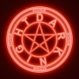

<!--
Hey! This awesome profile README was custom-designed for you by Gemini.
All sections have been carefully organized. Just copy and paste.
If you want to add or remove sections, follow the structure separated by '---'.
-->

<!-- ✨ HEADER BANNER & ANIMATED TITLE ✨ -->

<h1>

</h1>

Fusing art and technology to bring creative ideas to life.

<!-- 🌌 ABOUT ME SECTION 🌌 -->

<h2>🌌 About Me</h2>

Hello! I'm <b>Yahya Ismayilov</b>. I've been working as a <b>3D Artist</b> and <b>Game Developer</b> for nearly 5 years. 
I specialize in creating stylized assets, immersive environments, and interactive experiences.

<!-- 🛠️ TECH STACK & TOOLS 🛠️ -->

<h2 align="center">🛠️ My Tech Stack & Tools</h2>

<!-- 3D & Design Tools -->

<!-- Game Engines -->

<!-- Programming & Scripting -->

<!-- 💼 PROFESSIONAL EXPERIENCE 💼 -->

<h2 align="center">💼 Professional Experience</h2>
<table width="100%">
<tr>
<td width="80" valign="top" align="center">

</td>
<td valign="top">
<strong>3D Character Animation Specialist</strong> 
<i>Legions Game Studio</i> 
<em>April 2025 - Present | Baku, Azerbaijan</em>
</td>
</tr>
<tr>
<td width="80" valign="top" align="center">

</td>
<td valign="top">
<strong>Chapter Lead</strong> 
<i>Unreal Engine Sumgait Chapter</i> 
<em>August 2025 - Present | Sumgayit, Azerbaijan</em>
</td>
</tr>
<tr>
<td width="80" valign="top" align="center">

</td>
<td valign="top">
<strong>3D Character Animation Specialist</strong> 
<i>Untitle GameStudio</i> 
<em>August 2025 - Present | Baku, Azerbaijan</em>
</td>
</tr>
<tr>
<td width="80" valign="top" align="center">

</td>
<td valign="top">
<strong>Founder & CEO</strong> 
<i>DarkNight Studio</i> 
<em>June 2021 - Present | Azerbaijan</em> 

Founded and currently managing an independent game studio dedicated to delivering innovative and immersive gaming experiences.

</td>
</tr>
</table>

<!-- 🎮 MY GAMES SHOWCASE 🎮 -->

<h2 align="center">🎮 My Games Showcase</h2>
<table width="100%">
<tr>
<td width="160" valign="top" align="center">

</td>
<td valign="top">
<a href="https://store.steampowered.com/app/3626020/Despicable_Boss/" target="_blank">
<strong>Despicable Boss</strong>
</a>
 
<em>Platform: Steam</em> 

An exciting roguelike shooter where you play as an employee seeking revenge on your boss.

</td>
</tr>
<tr>
<td width="160" valign="top" align="center">

</td>
<td valign="top">
<a href="https://www.google.com/search?q=https://darknightstudio.itch.io/wings-of-hope" target="_blank">
<strong>Wings of Hope</strong>
</a>
 
<em>Platform: itch.io</em> 

A short and emotional adventure game about a person trying to carry a flower to the top of a mountain.

</td>
</tr>
</table>

<!-- 📊 GITHUB & LEETCODE STATS 📊 -->

<h2 align="center">📊 My GitHub & LeetCode Stats</h2>

<!-- 🌍 FIND ME ONLINE 🌍 -->

<h2 align="center">🌍 Find Me Online</h2>

<!-- Profile Views Counter -->

<!-- Final Note -->

⭐ <i>Always exploring new creative challenges in game development and 3D art.</i> ⭐

