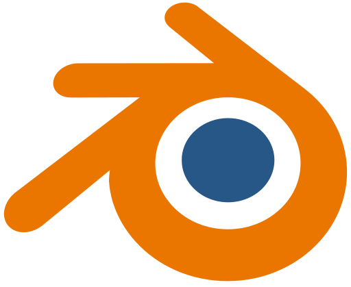

# 👋 Hi, I'm Yahya Ismayilov

  

---

### 🌌 About Me
Hello! My name is **Yahya Ismayilov**.
I have been working as a **3D Artist** and **Game Developer** for almost **5 years**.
I specialize in creating stylized assets, immersive environments, and interactive experiences.
My passion is combining art and technology to bring creative ideas to life.
---
### 💼 My Work Experience (via LinkedIn)

---

### 🛠️ Tools & Software

| Icon                                                                                                     | Application       | Level      | Experience        |
| :------------------------------------------------------------------------------------------------------- | :---------------- | :--------- | :---------------- |
|                      | **3ds Max** | `Beginner` | `6,000+ Hours`    |
|          | **Maya** | `Beginner` | `6,000+ Hours`    |
|                              | **Blender** | `Middle`   | `35,000+ Hours`   |
|                                            | **Cinema 4D** | `Beginner` | `6,000+ Hours`    |
|                                                 | **ZBrush** | `Beginner` | `9,000+ Hours`    |
|                                  | **Substance P.** | `Middle`   | `12,000+ Hours`   |
|      | **Unreal Engine** | `Middle`   | `28,000+ Hours`   |

---

### 💻 Programming & Scripting

  
  
  

---

### 📊 GitHub & LeetCode Stats

  
  

---
### 🌍 Find Me Online

  
  
  
  
  
  

---

⭐ Always exploring new creative challenges in **game development** and **3D art**.
